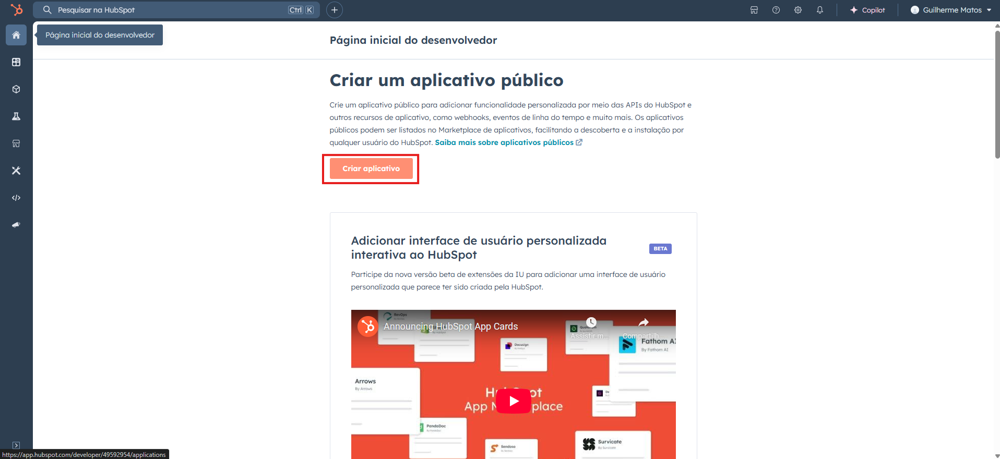

# HubSpot Integration - Meetime Test

Este projeto permite a integração com o HubSpot, oferecendo autenticação via OAuth2 e operações de criação de contatos. Além disso, possibilita a configuração de webhooks para receber notificações de eventos.

## 📌 Configuração do HubSpot

Antes de utilizar a integração, siga os passos abaixo para configurar seu aplicativo no HubSpot:

### 1️⃣ Criando uma Conta de Desenvolvedor

1. Acesse o [HubSpot Developer](https://developers.hubspot.com/);

1. Clique em **Get Started** e crie sua conta de desenvolvedor;
2. Após o login, acesse a aba **Apps** e clique em **Create App**.



### 2️⃣ Configurando o Aplicativo

1. Defina um nome para o seu aplicativo;
2. Em **URLs de Redirecionamento**, adicione:
    
    ```
    http://localhost:8080/auth/callback
    ```
    
3. Selecione os seguintes escopos de permissão:
    - `crm.objects.contacts.read`
    - `crm.objects.contacts.write`
    - `crm.schemas.contacts.write`


### 3️⃣ Obtendo as Credenciais do Aplicativo

Após a criação do aplicativo, copie as seguintes credenciais:

- **Client ID**
- **Client Secret**
- **Redirect URI**

Essas credenciais devem ser configuradas no arquivo `.properties` ou em variáveis de ambiente.

## 🌍 Configuração do Webhook

Para receber eventos do HubSpot via webhooks, siga os passos abaixo:

### 1️⃣ Configurando a URL do Webhook

1. No painel do aplicativo no HubSpot, acesse **Webhooks**;
2. Adicione a URL do webhook na seção **URL de destino**, que será utilizada para receber eventos:
    
    ```
    https://<SEU_DOMÍNIO>/webhook/hubspot
    ```
    
    > Importante: O HubSpot exige URLs HTTPS, então, se estiver rodando localmente, utilize o ngrok para expor seu serviço:
    > 
    
    ```
    ngrok http 8080
    ```
    
3. Selecione os eventos que deseja escutar (ex: criação e atualização de contatos);
4. Salve as configurações e teste o webhook.

## ⚙️ Configuração do Projeto

Antes de iniciar o serviço, configure as seguintes variáveis:

```xml
spring.application.name=meetime-test

server.port=8080

hubspot.auth-uri=https://app.hubspot.com/oauth/authorize
hubspot.token-uri=https://api.hubapi.com/oauth/v1/token
hubspot.client-id=<SEU_CLIENT_ID>
hubspot.client-secret=<SEU_CLIENT_SECRET>
hubspot.redirect-uri=http://localhost:8080/auth/callback

hubspot.api-url=https://api.hubapi.com/crm/v3/objects/contact
```

## 🚀 Executando o Serviço

1. Clone este repositório:
    
    ```bash
    git clone <url_do_repositorio>
    ```
    
2. Entre na pasta onde foi clonado o reposítorio:
    
    ```bash
    cd meetime-test
    ```
    
3. Execute esse comando para iniciar o projeto
    
    ```bash
    mvn spring-boot:run
    ```
    

## 🔗 Endpoints Disponíveis

### 🔑 Autenticação

- **Iniciar Login OAuth2:** `GET /auth/url`
- **Callback OAuth2:** `GET /auth/callback`

### 👥 Contatos

- **Criar contato:** `POST /contacts/create`
- **Listar contatos:** `GET /contacts/list`

### 🔔 Webhooks

- **Receber eventos do HubSpot:** `POST /webhook/hubspot`

## ⚠️ No final vou deixar um passo a passo para rodar a aplicação

---

## 📖 Documentação da API

Após iniciar o serviço, acesse a documentação no Swagger UI:

```
http://localhost:8080/swagger-ui/index.html
```

## 📚 Documentação Técnica

### 📌 Decisões Técnicas e Motivação para o Uso de Bibliotecas

O projeto foi desenvolvido utilizando **Spring Boot 3.4.4** e **Java 21**, aproveitando a robustez do framework para a construção de aplicações seguras e escaláveis. A autenticação OAuth2 foi implementada utilizando a biblioteca `spring-security-oauth2-client`, garantindo conformidade com os padrões de segurança modernos. Para comunicação com a API do HubSpot, utilizamos o **RestTemplate**, permitindo fácil integração com os serviços externos.

A escolha do **Swagger UI** para documentação da API visa facilitar o desenvolvimento e os testes, permitindo uma interface interativa para explorar os endpoints disponíveis.

### 🔮 Possíveis Melhorias Futuras

1. **Finalização do CRUD**: Atualmente, o projeto permite a criação e leitura de contatos, mas ainda pode ser expandido para incluir edição e remoção de registros.
2. **Aprimoramento da Segurança**: Implementar melhores práticas de segurança, como a rotação de tokens, proteção contra CSRF e a utilização de OAuth2 PKCE para um fluxo mais seguro.
3. **Melhoria no Gerenciamento de Erros**: Criar uma camada mais robusta de tratamento de erros para lidar melhor com falhas de requisição na API do HubSpot.

---

## 🔥 Considerações Finais

- Certifique-se de que a URL do webhook está acessível publicamente.
- Para testes locais, utilize **ngrok** para expor a API via HTTPS.
- O projeto utiliza **Java 21** e **Spring Boot 3.4.4**, garantindo compatibilidade com tecnologias modernas.

Com essas configurações, sua integração com o HubSpot estará pronta para autenticar usuários, gerenciar contatos e receber eventos de maneira segura e eficiente! 🚀

# 🚶‍♂️Passo a Passo para utilizar a aplicação

### 1️⃣ Criando uma Conta de Testador

1. Acesse o [HubSpot Developer](https://developers.hubspot.com/);


### 2️⃣ Autenticando no HubSpot

1. Acesse o endpoint

```
http://localhost:8080/auth/url
```


1. Copie a URL que ele vai devolver.
2. Jogue a URL no Google, e selecione a conta de TESTADOR que você criou


⚠️ Feito isso, o access token já foi gerado e está guardado em memória no Java.

### 2️⃣ Criação de Contato


### 3️⃣ Listar Contatos


[Meetime-Test.postman_collection.json](./arquivosReadme/Meetime-Test.postman_collection.json)

Collection do Postman!